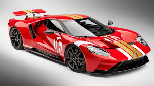
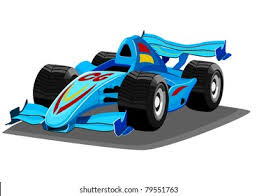
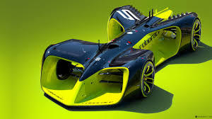

# CSharpSpeedRush

A simple and fun C# WPF car racing game! Select your car, race against AI opponents, and see who finishes first. The race is visualized with car images or colored rectangles on a stylish gradient track.

## Features
- Selectable player car with different stats
- Three AI opponents
- Animated race with finish line and leaderboard
- Sound effect on win
- Modern, visually appealing UI

## How to Run
1. **Clone or download this repository.**
2. **Open the solution (`CSharpSpeedRush.sln`) in Visual Studio.**
3. **Build the project.**
4. **Run the project (F5 or `dotnet run --project CSharpSpeedRush.csproj`).**

## Adding Car Images




**Properties**, and set:
  - **Build Action:** Content
  - **Copy to Output Directory:** Copy if newer

## Screenshots
Add your own screenshots to this section! To add a screenshot:
1. Take a screenshot of the running app (e.g., using Windows Snipping Tool).
2. Save it in the project root or a `screenshots/` folder.
3. Add a markdown image link below, for example:

```


```

Enjoy racing in CSharpSpeedRush! 
